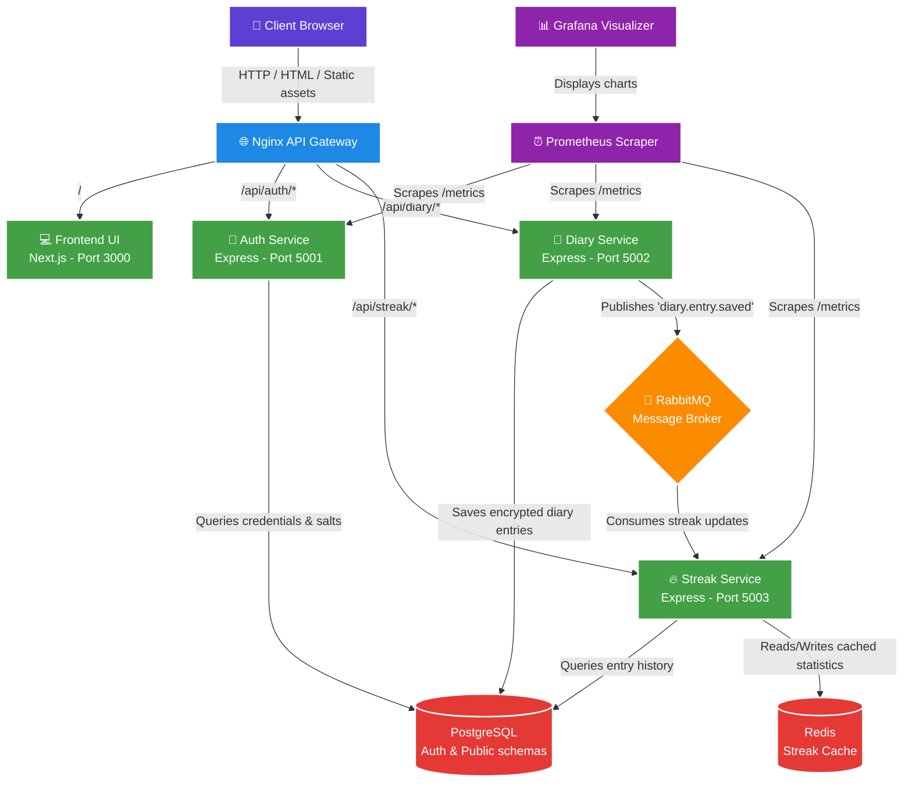
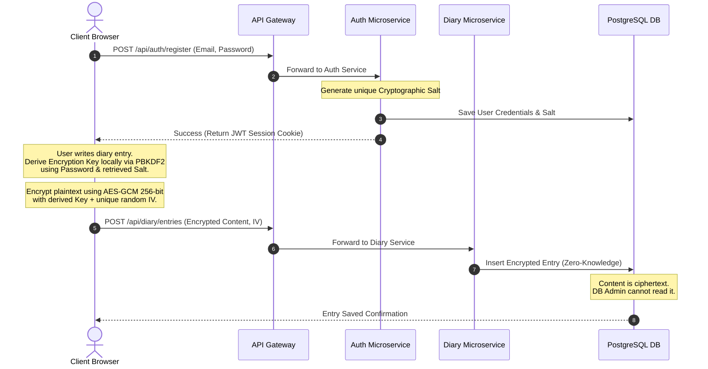
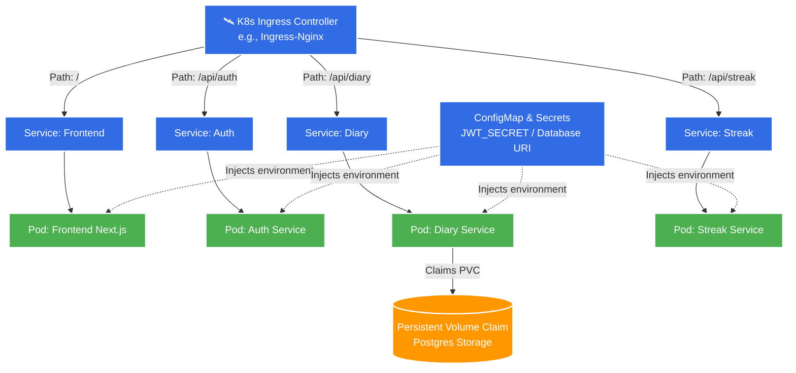
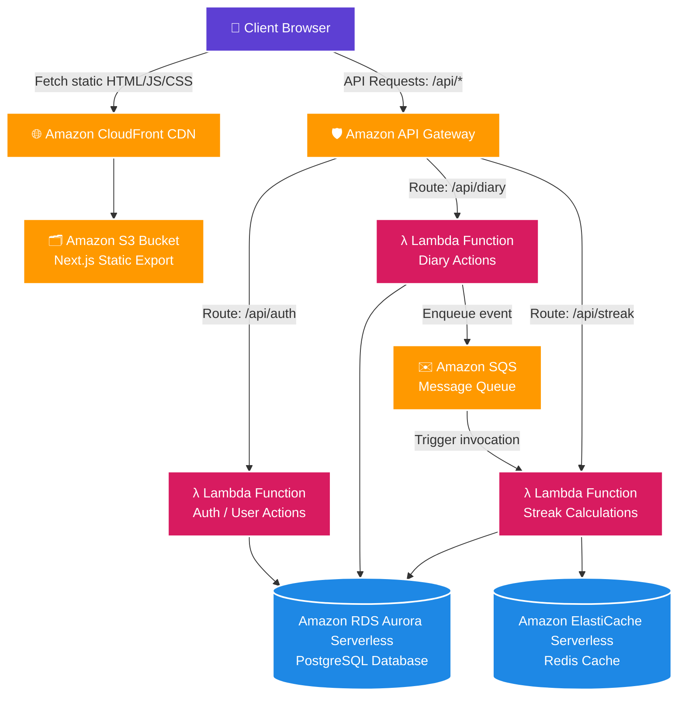

# Krypt 📔 - System Design & Architecture Presentation

This presentation document details the architecture, design choices, data flow mechanisms, and future cloud-native roadmaps for the **Krypt Secure Diary Application**.

---

## 🗺️ 1. Current Microservices Architecture & Data Flow
The current system operates as a decoupled, multi-container microservices application. Below is the active data flow routing requests through the Nginx gateway down to the respective databases, cache stores, and event brokers.

### System Architecture Flowchart

---

## 🔒 2. Zero-Knowledge Cryptography Data Flow
Security is built into Krypt using a **Zero-Knowledge client-side architecture**. The server stores the ciphertexts but holds no decryption capability.

### Cryptographic Lifecycle Sequence

---

## ☸️ 3. Scaling with Kubernetes (Orchestration Pipeline)
When moving from Docker Compose to a clustered cloud environment, Kubernetes orchestrates the microservices natively. 

### Kubernetes Architecture Model

### Key Kubernetes Benefits for Krypt:
1. **ConfigMaps & Secrets Decoupling**: Application settings are decoupled from source code, injected dynamically into container namespaces.
2. **Horizontal Pod Autoscaling (HPA)**: If diary writes spike, Kubernetes scales the `diary-service` pod count from 1 to 5 dynamically based on CPU/Memory load.
3. **Self-Healing Pods**: If a microservice crashes or experiences memory leaks, Kubernetes immediately terminates the pod and spins up a new instance.
4. **Zero-Downtime Rolling Updates**: Deploy updates to individual microservices container images one pod at a time without interrupting frontend user traffic.

---

## ⚡ 4. Cloud Serverless Architecture (Future Roadmap)
For the lowest operational overhead, high scaling potential, and pay-per-execution billing, Krypt can be migrated to a **Serverless cloud architecture on AWS**.

### Serverless Architecture Diagram

### Migration Blueprint to Serverless:
To migrate this codebase to AWS Serverless:
1. **Refactor HTTP Framework to Handler Functions**:
   Replace the Express `app.listen()` and router setup in `services/*/src/index.ts` with serverless adapters (like `@vendia/serverless-express` or standard AWS handler entrypoints).
2. **Next.js Static Export**:
   Build the Next.js frontend as a static export (`output: 'export'`) and host the assets on an **Amazon S3** bucket fronted by **CloudFront CDN** for instant edge performance.
3. **Swap RabbitMQ with Amazon SQS**:
   Replace the `amqplib` messaging logic in the Diary & Streak services with the AWS SDK calling **Amazon SQS** queues or **Amazon EventBridge**. This eliminates the need to run, manage, and patch message broker nodes.
4. **Database Migration**:
   Connect the Lambda functions to **Amazon RDS Aurora Serverless v2 (PostgreSQL)**, which scales connection pools automatically and scales capacity to zero when not in use.
5. **Caching Migration**:
   Point your Redis connection URLs to **Amazon ElastiCache Serverless (Redis)** to handle memory caches without managing servers.
